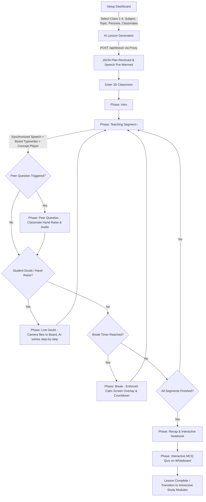

# 🏫 Sparsh Mukthi 3D — Product Architecture & Technical Master Document

> **"Democratizing Spatial & Interactive Education — Liberating Every Child from Hardware Barriers with Zero-Touch 3D AI Learning."**

---

## 1. Executive Summary & Product Motto

### 1.1 Etymology & Brand Motto
- **Sparsh (स्पर्श)**: Sanskrit for *Touch*, *Tactile Presence*, or *Sensory Connection*. Represents the natural, spatial, and touchless interaction model that brings abstract educational concepts into tangible, physical awareness.
- **Mukthi (मुक्ति)**: Sanskrit for *Liberation*, *Freedom*, or *Emancipation*. Represents freeing underserved learners from expensive hardware barriers, geographic isolation, and rigid, non-interactive rote learning.

**Official Motto**:
> *"Hardware Mukthi, Spatial Sparsh: Transforming every ordinary screen into a touchless, AI-taught 3D classroom for every child, anywhere."*

### 1.2 Core Problem & Philosophical Mission
Traditional ed-tech for primary school children (Classes 1–4, ages 6–10) suffers from three fundamental bottlenecks:
1. **The Hardware & Economic Barrier**: High-quality 3D/VR spatial learning experiences typically require \$300–\$500 standalone VR headsets (e.g., Meta Quest) and physical controllers. Low-income and rural schools cannot afford them.
2. **Passive Video Fatigue**: Existing remote learning relies heavily on static 2D pre-recorded video lectures where children cannot ask questions, receive immediate doubt resolution, or feel social classroom presence.
3. **Teacher Shortage & Attention Deficit**: One-on-one personalized tutoring is economically unfeasible for millions of children, leading to foundational learning gaps in early primary education.

**Sparsh Mukthi 3D** solves this by converting any standard commodity web browser, cheap laptop/pc, low-resolution webcam, or budget \$2 Google Cardboard smartphone into an interactive, spatial 3D virtual school where:
- A real 3D AI teacher plans and delivers structured spoken lessons.
- Virtual classmate avatars react, raise hands, and ask peer questions.
- A live whiteboard writes solutions step-by-step in sync with teacher speech.
- Children control the room using **100% local, touchless hand gestures** via computer vision.
- A **WebRTC bridge** transforms ordinary smartphones into head-tracked VR headsets with zero extra hardware cost.

---

## 2. High-Level Architecture & User Journey

### 2.1 System Architecture Diagram

```
                                  ┌─────────────────────────────────────────────────────────┐
                                  │                     USER INTERACTION                    │
                                  │  - Low-Res Webcam (MediaPipe WASM Gesture Engine)       │
                                  │  - Microphone (Web Speech Recognition STT / Voice In)   │
                                  │  - Smartphone Sensors (DeviceOrientation Gyro Matrix)  │
                                  └────────────────────────────┬────────────────────────────┘
                                                               │
                                                               ▼
┌────────────────────────────────────────────────────────────────────────────────────────────────────────────────────────┐
│                                          ZUSTAND CENTRAL STORE & LESSON ENGINE                                         │
│  State Machine: loading ➔ intro ➔ teaching(1..N) ➔ peerQuestion ➔ doubt ➔ break ➔ recap ➔ quiz ➔ end                 │
│  Pacing Mechanism: Speech Synthesis Utterance Events (onstart / onend callbacks drive state transitions)                │
└─────────────┬───────────────────────────────┬───────────────────────────────┬───────────────────────────────┬──────────┘
              │                               │                               │                               │
              ▼                               ▼                               ▼                               ▼
┌───────────────────────────┐   ┌───────────────────────────┐   ┌───────────────────────────┐   ┌───────────────────────────┐
│     3D GRAPHICS SCENE     │   │    EXPRESS PROXY SERVER   │   │   SPEECH & AUDIO ENGINE   │   │   WEBRTC VR P2P BRIDGE    │
│ - Three.js / R3F Canvas   │   │ - Multi-Tier AI Pipeline  │   │ - Orpheus TTS (PyTorch/   │   │ - Host Canvas Stream      │
│ - Rigged Avatar (Teacher) │   │   (Gemini ➔ Claude ➔      │   │   ONNX multi-voice)       │   │   Capture @ 30 FPS        │
│ - Skeleton Clones (Peers) │   │   OpenAI Fallback)        │   │ - Gemini 2.5 Flash TTS    │   │ - DataChannel Gyro @ 30Hz │
│ - 3D Whiteboard Plane     │   │ - Structured JSON Schema  │   │ - Browser SpeechSynthesis │   │ - Low-Latency FPV Camera  │
│ - FPV Smooth Camera Rig   │   │ - Child Safety Enforcement│   │ - Speech Pre-Warm Cache   │   │   Euler Quaternion Match  │
└───────────────────────────┘   └───────────────────────────┘   └───────────────────────────┘   └───────────────────────────┘
```

### 2.2 End-to-End User Journey



---

## 3. Core Component Breakdown & Technical Specifications

### 3.1 Setup Dashboard (`src/components/dashboard/`)
- **Config Parameters**:
  - `classLevel`: Classes 1, 2, 3, or 4.
  - `subject`: Mathematics, Science, English, Environmental Studies (EVS).
  - `topic`: Selected from predefined curriculum tree (`src/data/curriculum.js`).
  - `teacher`: Persona choice (`Miss Anaya`, `Mr. Vikram`, `Miss Sarah`, `Aswath Mu`, `Ishaan`), mapping custom 3D model URLs, TTS voice IDs, and teaching styles.
  - `classmateCount`: 2 to 6 virtual peers.
  - `sessionLength`: 10 to 30 minutes.
  - `breakInterval`: Enforced rest duration timer (e.g., every 5 or 7 minutes).
  - `customDoubt`: Optional initial question pre-seeded into the lesson.

---

### 3.2 3D Graphics Engine & Renderer Layer

#### Framework Stack
- **React 18** & **Vite**: High-performance frontend toolchain.
- **Three.js** & **React Three Fiber (R3F)** (`@react-three/fiber`): Declarative 3D WebGL scenegraph.
- **Drei** (`@react-three/drei`): Helper utilities (`useGLTF`, `PerspectiveCamera`, `CanvasTexture`).

#### Key 3D Scene Components (`src/components/world/`)

1. **Classroom Mesh (`public/models/classroom.glb`)**:
   - 30MB low-poly 3D environment including student desks, chairs, windows, ceiling lights, teacher desk, and main blackboard frame.
2. **Teacher Avatar (`Teacher.jsx`)**:
   - **Model Rigs**: `emilian-avatar.glb` (Avaturn humanoid) and `cop/scene.gltf` (Mr. Vikram rig).
   - **Animation State Machine**: Cross-fades skeletal clip states (`IdleV4.2(maya_head)`, `greet`, `think`, `look_around`, `thanks`, `walking`, `running`).
   - **Procedural Gesture Blending**: While speaking (`spoken === true`), randomly cycles active talk-gestures every 2–4 seconds and applies subtle sinusoidal head-bone jitter (`head.rotation.y = Math.sin(time * 3) * 0.05`).
3. **Virtual Classmates (`Students.jsx`)**:
   - Uses `SkeletonUtils.clone()` to instantiate $N$ student models from a single GLTF rig without duplicate GPU asset loading.
   - **Per-Student Customizations**: Random scale jitter ($\pm 8\%$), distinct material hue tints, desynchronized idle clip offsets, and hand-raising arm animations (`greet`) during peer questions.
4. **Interactive Whiteboard Plane (`Whiteboard.jsx`)**:
   - A 3D rectangular plane mesh positioned at `(0, 0.6, -16.6)` with a dynamic 2D HTML5 `CanvasTexture`.
   - Updated live via `src/lib/boardBridge.js` and `ExcalidrawBoard.jsx`.
5. **First-Person View Camera Controller (`FPVCamera.jsx`)**:
   - Positioned at the 2nd-row student desk (`SEAT = (0, -0.9, 5.2)`).
   - Dynamically calculates look-at target vector:
     $$\mathbf{T}_{\text{final}} = \mathbf{T}_{\text{phase}} + \mathbf{O}_{\text{gesture}} + \mathbf{O}_{\text{gyro}} + \mathbf{O}_{\text{mouse}}$$
   - **Smooth Exponential Lerp**:
     $$\mathbf{C}_{\text{rot}}(t + \Delta t) = \mathbf{C}_{\text{rot}}(t) + \left(1 - e^{-\Delta t \cdot k}\right) \left(\mathbf{T}_{\text{final}} - \mathbf{C}_{\text{rot}}(t)\right)$$
   - **Dolly Zoom**: Zooming adjusts position forward along view vector and narrows FOV ($50^\circ \rightarrow 22^\circ$).

---

### 3.3 Computer Vision & Touchless Gesture Control Engine

#### Hardware & Execution Profile
- **Engine**: `@mediapipe/tasks-vision` `HandLandmarker`.
- **Execution Target**: Browser WebGL/WASM on a low-resolution webcam stream ($320 \times 240$ at 24 FPS).
- **Privacy & Latency**: 100% local client execution. Zero video frames leave the device.

#### Gesture Classification Math & Logic Matrix

| Gesture Symbol | Gesture Name | Mathematical / Logical Condition | Triggered Action |
| :--- | :--- | :--- | :--- |
| ✋ | **Hand Raise** | $\text{palmOpen} \land (p_y < 0.55)$ continuously accumulated for $\Delta t \ge 3000\,\text{ms}$ | Triggers `hand-raised` event; pauses lesson and opens student voice doubt phase. |
| 🖐 | **Palm Steer** | $\Delta x = p_x - 0.5,\; \Delta y = p_y - 0.5$; apply deadzone $\| \Delta \| > 0.015$ | Adjusts 3D camera pan/tilt orientation ($g_{\text{yaw}}, g_{\text{pitch}}$). |
| ☝️ | **Virtual Cursor** | Index tip coordinate $L_8 = (x_8, y_8)$ mapped through frame reduction factor ($0.16$) | Moves 2D touchless cursor overlay with low-pass EMA filter. |
| ✌️ | **Touchless Click** | $\frac{\text{dist}(L_8, L_{12})}{\text{handSize}} < 0.55$ (index & middle fingertip proximity) | Triggers synthetic DOM click or R3F raycast selection; latches until ratio $> 0.75$ (hysteresis). |
| 🙌 | **Two-Hand Zoom** | Dual hand detection: $\text{dist}(L_{8,\text{left}}, L_{8,\text{right}}) = \sqrt{\Delta x^2 + \Delta y^2}$ | $\Delta \text{dist} > 0.045$: Spreading apart = Zoom IN; Together = Zoom OUT. |

#### Python Desktop Companion (`tools/virtual-mouse/virtual_mouse.py`)
- Python standalone application using OpenCV, MediaPipe Hands, and PyAutoGUI.
- Allows touchless control over the entire Windows OS desktop environment outside the browser window.

---

### 3.4 Low-Cost Smartphone VR Transformation & WebRTC P2P Bridge

#### Conceptual Innovation
Converts any low-cost Android/iOS smartphone running Chrome/Safari inserted into a \$2 Google Cardboard container into a full-featured head-tracked VR headset. The PC/Laptop handles WebGL rendering and AI, while the phone acts purely as a display receiver and orientation sensor.

#### WebRTC Architecture & Sensor Protocol (`src/lib/webrtcBridge.js`)

```
   [ LAPTOP (Host Render Engine) ]                                     [ SMARTPHONE (Cardboard VR Client) ]
                 │                                                                      │
                 │─── 1. captureStream(30) from R3F WebGL Canvas                        │
                 │─── 2. Create RTCPeerConnection & Generate SDP Offer                  │
                 │─── 3. POST /api/webrtc/signal {role: "host", offer} ────────────────>│ (Saved on Proxy Server)
                 │                                                                      │
                 │<── 4. GET /api/webrtc/signal/host ───────────────────────────────────│
                 │                                                                      │─── 5. Set Remote Desc & Create Answer
                 │<── 6. POST /api/webrtc/signal {role: "client", answer} ──────────────│
                 │                                                                      │
                 │══════════════════ Direct WebRTC P2P Connection Established ═══════════│
                 │                                                                      │
                 │──────────────── H.264 Video Stream (30 FPS, Low Latency) ───────────>│ (Full-screen Mobile Video)
                 │                                                                      │
                 │<────────────── Sensor Data Payload {yaw, pitch} @ 30Hz ──────────────│ (via RTCDataChannel)
```

#### Gyroscope Sensor Fusion Math
The mobile client listens to `deviceorientation` events ($\alpha, \beta, \gamma$):
```javascript
// Landscape VR Orientation Adjustment (Phone turned sideways in Cardboard)
const alphaRad = (e.alpha * Math.PI) / 180;
const betaRad  = (e.beta  * Math.PI) / 180;
const gammaRad = (e.gamma * Math.PI) / 180;

if (isLandscape) {
  yaw   = (window.orientation === -90) ? -betaRad : betaRad;
  pitch = (window.orientation === -90) ? -gammaRad : gammaRad;
} else {
  yaw   = alphaRad;
  pitch = betaRad - (Math.PI / 2);
}
```
Payload streamed over `RTCDataChannel`: `{"type": "gyro", "yaw": 0.142, "pitch": -0.051}`. Host updates `remoteGyro` in Zustand, applying Euler quaternions to `FPVCamera.jsx`.

---

### 3.5 AI Orchestration Backend & Child Safety Engine

#### Express Proxy Server (`proxy-server/proxy.js`)
Handles secure API key management, prompt synthesis, structured JSON validation, multi-provider fallbacks, and WebRTC signaling.

#### Multi-Tier Provider Fallback Architecture
```
                         ┌─────────────────────────────────────────┐
                         │         Incoming Client Prompt          │
                         └────────────────────┬────────────────────┘
                                              │
                                              ▼
                         ┌─────────────────────────────────────────┐
                         │ 1. Gemini (Primary Provider)            │
                         │    gemini-3-flash-preview /             │
                         │    gemini-3.1-flash-lite                │
                         │    Strict responseSchema Enforcement    │
                         └────────────────────┬────────────────────┘
                                              │ (On Rate Limit / Exception)
                                              ▼
                         ┌─────────────────────────────────────────┐
                         │ 2. Claude (First Fallback)              │
                         │    claude-opus-4-8                      │
                         │    Structured output_config JSON        │
                         └────────────────────┬────────────────────┘
                                              │ (On Error)
                                              ▼
                         ┌─────────────────────────────────────────┐
                         │ 3. OpenAI (Second Fallback)             │
                         │    gpt-4o-mini (SDK client)             │
                         │    response_format: json_object         │
                         └─────────────────────────────────────────┘
```

#### Child Safety Enforcement (`SAFETY` System Prompt)
All prompts inject mandatory safety guardrails:
- Target audience: Primary school children aged 6–10 (Classes 1–4).
- Warm, encouraging, empathetic pedagogical tone.
- Short sentences, clear vocabulary, zero complex jargon.
- Strict prohibition of violence, adult themes, political content, or frightening material.
- Controlled hallucination guardrails; gentle redirection if off-topic questions are asked.

---

### 3.6 Multi-Persona Speech Synthesis & Pacing Engine

#### Multi-Tiered TTS Pipeline (`src/lib/tts.js` & `orpheus-server/`)
1. **Orpheus TTS Server (Primary)**: Self-hosted PyTorch/ONNX server delivering natural human voices. Assigns unique voice IDs per teacher persona (`tara`, `leah`, `leo`, `dan`) and per classmate.
2. **Gemini TTS (Secondary)**: `gemini-2.5-flash-preview-tts` generating 24kHz audio streams.
3. **Browser Web Speech API (`window.speechSynthesis`) (Fallback)**: Native client synthesis if cloud/local servers fail.

#### Speech-Driven Pacing Mechanics (`useLessonEngine.js`)
Unlike traditional engines driven by arbitrary timers, **Sparsh Mukthi 3D is strictly paced by speech completion**:
```javascript
// Speech Utterance Callback Driven Phase Advancement
speakUtterance(lineText, {
  onstart: () => {
    setTeacherSpeaking(true);
    updateWhiteboardTypewriter(lineIndex);
    updateHUDCaptions(lineText);
  },
  onend: () => {
    setTeacherSpeaking(false);
    advanceToNextSentenceOrPhase();
  }
});
```

#### Asynchronous Speech Pre-Warming (`warmSpeechCache`)
Upon receiving the lesson JSON plan, `warmSpeechCache()` immediately pre-fetches audio streams for all upcoming sentences across the entire lesson into an in-memory `Map` cache. Playback between sentences is zero-latency.

---

### 3.7 Dynamic Whiteboard Engine, Visual Concept Player & Notebook

#### 1. Whiteboard Rendering Bridge (`src/lib/boardBridge.js`)
- HTML5 2D Canvas context rendering directly onto the 3D blackboard texture plane.
- **Typewriter Reveal**: As speech advances to sentence index $N$, board bullet points marked with `afterSentence <= N` animate onto the board in real time.

#### 2. Visual Concept Player (`ConceptPlayer.jsx` & `animations.jsx`)
- Integrated Remotion `@remotion/player` strip embedded inside the whiteboard layout.
- Renders dynamic animated visual diagrams based on the lesson plan schema `visual: { kind, items, caption }` (e.g., animated fraction bars, moving solar orbits, pulsing geometric shapes).

#### 3. Interactive Notebook ("My Whiteboard")
- Every completed teaching segment, diagram, and doubt solution is auto-saved to `boardPages` in Zustand.
- Students can open a full-screen overlay to browse, review, and export handwritten-style lesson notes.

#### 4. Interactive Quiz Integration
- During the `quiz` phase, multiple-choice questions appear on the whiteboard canvas.
- Teacher speech pauses completely, requiring the child to tick an option on the whiteboard before spoken feedback is provided.

---

### 3.8 Immersive Subject Exploration Modules

#### 1. Solar System Module (`src/components/solar/SolarSystem.jsx`)
- Procedural GLSL shaders for solar surfaces, planet rings, atmosphere glows, starfields, and moon orbits.
- **Solar "Eye Mode" (`EyeBackground.jsx`)**: Swaps the dark space background for a live, transparent, mirrored webcam feed. Planets float inside the student's physical room as an Augmented Reality (AR) experience.

#### 2. Heart Journey Module (`src/components/heart/HeartSystem.jsx` & `HeartHUD.jsx`)
- 3D interactive human heart anatomy model featuring 4 pulsing chambers (Right Atrium, Right Ventricle, Left Atrium, Left Ventricle).
- **Catmull-Rom Tube Blood Flow**: 4 dynamic 3D tube geometries with animated flowing particle systems simulating oxygenated and deoxygenated blood flow.
- Guided 4-step interactive blood circulation tour.

#### 3. Offline Text-to-3D Generation Toolchain (`tools/gen3d/`)
- Offline pipeline utilizing OpenAI Shap-E (CPU diffusion) to generate 3D `.obj` prop meshes from text prompts, converted to `.glb` via Blender python background scripts.

---

## 4. Structured Data Schemas

### 4.1 Lesson Plan JSON Schema (`POST /api/lesson`)

```json
{
  "$schema": "http://json-schema.org/draft-07/schema#",
  "type": "object",
  "required": ["title", "intro", "segments", "recap", "quiz"],
  "properties": {
    "title": { "type": "string" },
    "intro": {
      "type": "array",
      "items": { "type": "string" }
    },
    "segments": {
      "type": "array",
      "items": {
        "type": "object",
        "required": ["heading", "teacherLines", "boardPoints"],
        "properties": {
          "heading": { "type": "string" },
          "teacherLines": {
            "type": "array",
            "items": { "type": "string" }
          },
          "boardPoints": {
            "type": "array",
            "items": {
              "type": "object",
              "properties": {
                "text": { "type": "string" },
                "afterSentence": { "type": "integer" }
              }
            }
          },
          "visual": {
            "type": "object",
            "properties": {
              "kind": { "type": "string" },
              "items": { "type": "array" },
              "caption": { "type": "string" }
            }
          },
          "peerQuestion": {
            "type": "object",
            "properties": {
              "studentIndex": { "type": "integer" },
              "question": { "type": "string" },
              "teacherAnswer": { "type": "string" }
            }
          }
        }
      }
    },
    "recap": {
      "type": "array",
      "items": { "type": "string" }
    },
    "quiz": {
      "type": "array",
      "items": {
        "type": "object",
        "required": ["question", "options", "correctIndex", "explanation"],
        "properties": {
          "question": { "type": "string" },
          "options": { "type": "array", "items": { "type": "string" } },
          "correctIndex": { "type": "integer" },
          "explanation": { "type": "string" }
        }
      }
    }
  }
}
```

### 4.2 Live Doubt Resolution Schema (`POST /api/doubt`)

```json
{
  "type": "object",
  "required": ["spokenAnswer", "boardSteps", "reassurance"],
  "properties": {
    "spokenAnswer": { "type": "string" },
    "boardSteps": {
      "type": "array",
      "items": { "type": "string" }
    },
    "reassurance": { "type": "string" }
  }
}
```

---

## 5. Performance, Reliability & Graceful Degradation Matrix

### 5.1 Performance Optimization Benchmarks
- **Local Vision Execution**: $320 \times 240$ frame downsizing keeps CPU consumption $< 12\%$ on budget Intel i3 / Celeron processors.
- **3D Asset Batching**: Shared geometry and textures via `SkeletonUtils.clone()` reduce memory footprint to $< 45\text{MB}$ total VRAM.
- **Frame-Rate Independent Motion**: All camera panning, bone rotations, and UI overlays use exponential lerp ($\Delta t$-compensated) ensuring rock-solid 60 FPS visual smoothness.

### 5.2 Multi-Level Graceful Degradation Matrix

| Component | Primary Operational Mode | 1st Fallback Tier | 2nd Fallback Tier | Final Resilience State |
| :--- | :--- | :--- | :--- | :--- |
| **AI LLM Engine** | Gemini (`gemini-3-flash-preview`) | Claude (`claude-opus-4-8`) | OpenAI (`gpt-4o-mini`) | Friendly cached child fallback lesson plan. |
| **Speech Synthesis** | Orpheus PyTorch ONNX Server | Gemini 2.5 Flash TTS API | Browser `speechSynthesis` | Screen text captions & whiteboard display. |
| **User Interaction** | Local MediaPipe Gestures | Hold-to-Speak Mic (STT) | Keyboard / Mouse Inputs | Standard On-Screen HUD Buttons. |
| **VR Head Tracking** | Smartphone WebRTC Gyro Bridge | Desktop Mouse Steering | Automatic Camera Angles | Fixed Desk View Angle. |

---

## 6. Complete Repository File Structure & Ownership Map

```
sparsh-mukthi-3d/
├── .agents/                        # Customization skills & rules
├── .eslintrc.cjs                   # ESLint code style configuration
├── .gitignore                      # Git ignore rules
├── CODEX_SESSION.md                # Uncommitted WIP features tracking
├── README.md                       # High-level overview & quickstart
├── TECHNICAL_INTERVIEW_PREP.md     # 100-depth technical interview guide
├── claude.md                       # System architecture notes
├── index.html                      # HTML5 entry mounting canvas root
├── package.json                    # Dependencies (Three.js, R3F, Zustand, MediaPipe)
├── vite.config.js                  # Vite bundler configuration
│
├── proxy-server/                   # Express AI Proxy & Signaling Server
│   ├── .env                        # Provider API keys (Gemini, Claude, OpenAI)
│   ├── proxy.js                    # Multi-provider LLM chain, safety prompt & WebRTC signaling
│   ├── package.json                # Server dependencies (express, cors, openai, dotenv)
│   └── vercel.json                 # Serverless Vercel deployment manifest
│
├── orpheus-server/                 # Self-Hosted TTS Engine
│   └── cpu_server.py               # PyTorch/ONNX multi-voice speech synthesis server
│
├── tools/                          # Developer & Companion Tools
│   ├── gen3d/                      # Offline text-to-3D generation (Shap-E + Blender GLB script)
│   └── virtual-mouse/              # Python Windows OS touchless gesture control companion
│
├── public/                         # Static Assets
│   └── models/                     # 3D GLTF/GLB models (classroom.glb, emilian-avatar.glb, cop/)
│
└── src/                            # Main React 18 Application Source
    ├── App.jsx                     # Core application root & mode switcher
    ├── main.jsx                    # React DOM renderer entry
    ├── index.css                   # Global styles & design system tokens
    │
    ├── components/
    │   ├── dashboard/              # Setup screen (Class, Subject, Persona, Duration)
    │   ├── gesture/                # MediaPipe GesturePanel & touchless cursor HUD
    │   ├── heart/                  # Heart Journey 3D scene & interactive tour HUD
    │   ├── hud/                    # LessonHUD, captions, timer, doubt modal, break overlay
    │   ├── solar/                  # SolarSystem 3D scene & Solar "Eye" Mode
    │   ├── whiteboard/             # ExcalidrawBoard & Remotion ConceptPlayer
    │   └── world/                  # 3D Scene (Teacher, Students, Whiteboard, FPVCamera)
    │
    ├── data/
    │   └── curriculum.js           # Curriculum database (Classes 1-4 topics, Teacher presets)
    │
    ├── hooks/
    │   ├── useHandRaise.js         # MediaPipe hand-raise detector hook
    │   └── useLessonEngine.js      # Speech-driven phase machine conductor hook
    │
    ├── lib/
    │   ├── api.js                  # Axios client wrapper for proxy calls
    │   ├── boardBridge.js          # HTML5 Canvas 2D to 3D Whiteboard texture bridge
    │   ├── gestureState.js         # Reactive gesture state math & filtering
    │   ├── tts.js                  # Multi-tiered speech synthesis queue & pre-caching
    │   └── webrtcBridge.js         # Laptop-to-Phone WebRTC video stream & gyro sensor bridge
    │
    └── store/
        └── useLessonStore.js       # Central Zustand store (Lesson state, phases, board pages)
```

---

## 7. Deployment & Operations

### 7.1 Local Development Quickstart
```bash
# 1. Start AI Proxy Server (Port 3001)
cd proxy-server
npm install
node proxy.js

# 2. Start Frontend Application (Port 5173)
cd ..
npm install
npm run dev
```

### 7.2 Production Cloud Deployment (Vercel)
- **Frontend App**: Deployed via root Vite Vercel build configuration (`VITE_API_BASE` pointing at production proxy).
- **AI Proxy Backend**: Deployed as Vercel Serverless Node functions using `proxy-server/vercel.json`.
- **Orpheus TTS Server**: Deployed on GPU/CPU cloud instance (e.g., RunPod, AWS EC2) exposing OpenAI-compatible speech endpoints.

---

## 8. Summary of Strategic Impact

**Sparsh Mukthi 3D** establishes a new paradigm in equitable educational technology:
- **Zero Cost Escalation**: Brings high-end spatial VR learning to low-income children without requiring \$500 hardware.
- **Child Privacy First**: 100% local computer vision processing guarantees student security.
- **Pedagogical Autonomy**: AI avatar teachers deliver individualized, multi-modal instruction pacing automatically tailored to every child's voice questions and learning rate.
